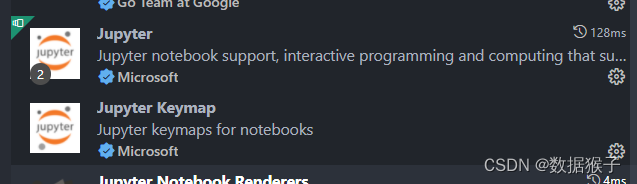

# Jupyter Notebook

> 主页：[https://jupyter.org/](https://jupyter.org/)

> 可以说，有了Jupyter，Python才在科学研究领域大放异彩，如果说没用过Jupyter，Python就没有入门。

## 简介

**Jupyter Notebook**是个非常方便策略分析工具，可以一边写文档一边执行程序，各大回测平台都有内置，其实自己搭建安装也很方便，可以作为自己的策略笔记本。

## 安装

```
pip install notebook
```

## 启动

```
jupyter notebook
```

默认运行在`http://localhost:8888/tree`，会自动浏览器弹出，效果见下图。

<figure><figcaption></figcaption></figure>

<figure><figcaption></figcaption></figure>

## VSCode中使用

我个人还是喜欢在VSCode中使用，在VSCode中点击`.ipynb`后缀文件，会自动安装下边两个插件，没自动安装就手动自己安装下。&#x20;

<figure><figcaption></figcaption></figure>

插件启用后，就可以直接在VSCode中运行`.ipynb`，相比网页版，既方便又美观，强烈推荐。&#x20;

<figure><figcaption></figcaption></figure>


